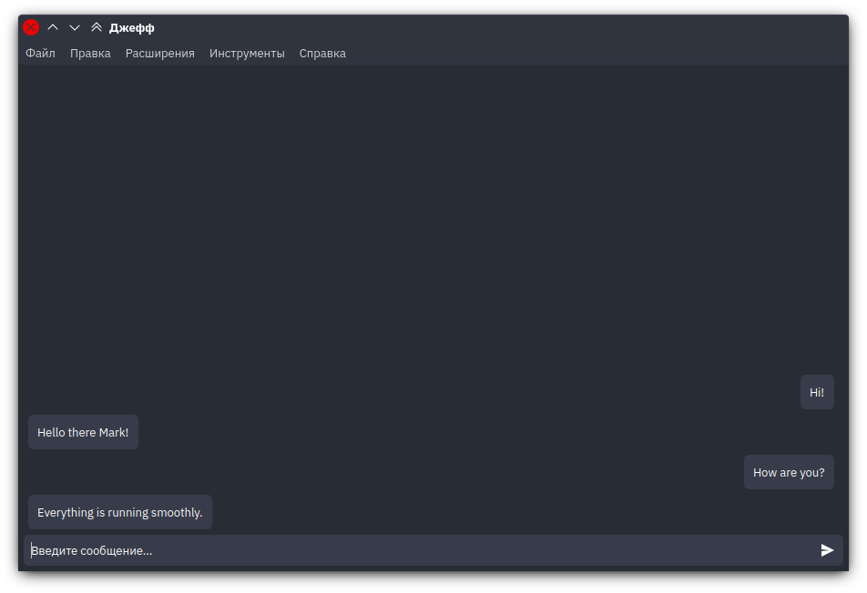
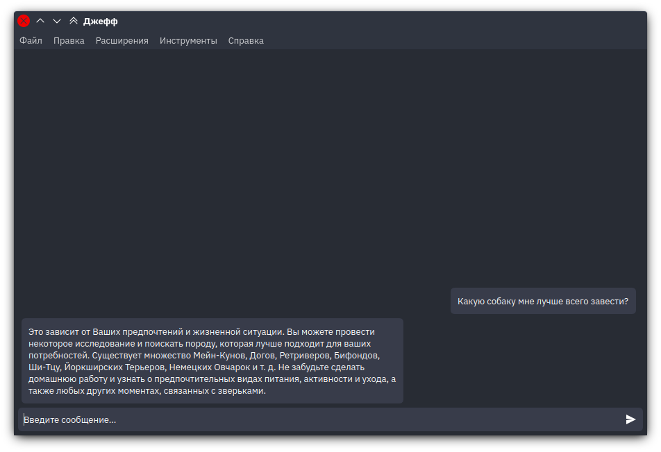

<p align="center">
    
</p>

Jeff is a highly customizable, extensible and cross-platform chatbot with a MIT license.

## Capabilities

1. Interaction in the "question-answer" mode.
2. Interaction in scenarios.
3. Interaction through extensions communicating with Jeff over TCP sockets.
4. [In development] Multi-user interaction via HTTP server.
5. [In development] Interaction via Telegram Bot.

## Features

1. TCP-server with JSON message format.
2. Extensions Notifier.
3. SQLite databases for phrases.
4. Storage of message history.
5. Extensions and scripts configurations with additional Python API - `jeff-api`.
6. [In development] Bundles with pre-installed extensions.

## Project structure

There are several subprojects:

1. `jeff-qt` desktop app
2. `jeff-api` extensions API for Python
3. `jeff-core` server

## Screenshots




## Databases development and Jeff Core Kit

### `*.j.db` format

Jeff uses the SQLite portable database format. Each individual database must have a `sources` table. If you want to create it manually, use the query: `CREATE TABLE "sources" ("source" text NOT NULL UNIQUE, "title" text, "weight" integer)`. `Source` field means table name in this DB, `title` is displayed in Jeff and `weight` is an optional field that prioritizes this expression source over others, which affects the layout of the response.

Each individual source is listed in the `sources` table and created with the query: `CREATE TABLE "table_name" ("address" integer NOT NULL UNIQUE, "phrase" text, "links" text, "exec" integer NOT NULL, "adprops" TEXT, PRIMARY KEY("address" AUTOINCREMENT))`.

Address is a unique phrase number in this table. The `links` column lists, separated by commas, the addresses of phrases for which this phrase is an activator. In other words, if the current phrase occurs in the user's input, Jeff will respond to him with those phrases whose addresses are indicated in the `links` column of the current phrase.

#### Properties `weight` and `adprops` in action

*Example 1.* Let the `t1` table contain an expression that looks for the `Turn on the TV` activator and issue the `Good!` reagent on it, while the `t2` table contains an expression that launches the script for turning on the TV on exactly the same activator. *There are three options for improving the output of the second expression:* you can set the weight for the table (so that all expressions from this table acquire such a weight), or you can set the weight for a specific expression (the `adprops` field stores JSON, the weight is set as an integer), or you also can set `consonant` additional property to `true`, and your message will be always used in Jeff output.

*Example 2.* Let there be an expression in table `t1` that looks for the `Turn on the light in the bedroom` activator, while there is another expression that looks for the `Turn on the light in the kitchen` activator. If the user enters `Turn on the light` or even `Turn on the lights` twice, the first time a random light will turn on, and the second time another light will turn on. This will happen because the percentage of `total_POC` input covered by both the first and second activators will be equal, and other things being equal, a random expression is chosen. But then the expression that was used less often than the others is always selected. In this way, a uniform use of the cache is achieved. *If you want to set one expression as the preferred expression in case of incomplete activation,* set its weight one or more units higher.

*Example 3.* Let the table `t1` contain two expressions with the same activators, which, nevertheless, have different additional properties. *If you want to process them and compose the response yourself,* write your own implementation of the composer in Python and include it in Jeff. *And if you also want to scan sources yourself or even connect your own sources,* write your own implementation of the scanner in Python and connect it too.

### <a name="select_candidates">Complete set of conditions for the selection of candidates</a>

Expressions compete with each other for the right to be a reagent for a given activator. There are the following conditions for choosing an expression (in descending order of importance):

1. Is the set of candidates empty?
2. Is the current candidate consonant (i.e. usable with other expressions)?
3. Are there any intersections with other expressions?
4. Is the coverage percentage greater than another expression?
5. And the weight of the expression is greater?
6. Has the expression been used in less cases?
7. Everything is up to chance.

## <a name="usable_settings">Usable settings</a>

1. Monologue mode. Allows Jeff to communicate with himself. Setting: `core-kit/ismonologuemodeenabled` (bool)
2. Output delay. Sets the time period in milliseconds in which the response message will be displayed and can be used to simulate human delay. Settings: `core-kit/isdelayenabled` (bool), `core-kit/mindelay` (ms), `core-kit/maxdelay` (ms)
3. Save history. Can save all your correspondence with Jeff. Setting: `core-kit/ishistorykeepingenabled` (bool)
4. Greeting. Sets the first message that is automatically sent to Jeff on startup. Settings: `core-kit/isgreetingsenabled` (bool), `core-kit/greetings` (str)
5. Script exit message. Keyword/expression that forces the script to end. Setting: `core-kit/scenarioexitter`
6. Server port. The port on which Jeff will listen for incoming connections from extensions. Setting: `core-kit/serverport` (uint16)
7. The time Jeff waits after sending the `terminate` signal and before forcing the extension to terminate. Setting: `core-kit/extensionkillsec` (sec)
8. Force search in the sources, not in the cache, if the user's current input is identical to his previous one. Setting: `core-kit/repeatedexplicitindb` (bool)
9. Default source. Declares a table in the database to which phrases that Jeff learned on his own or with the help of extensions will be added. Settings: `sources/defaultsourcepath`, `sources/defaultsourcecontainer` (both str)
10. **[Security]** Authorization with a key on the server. Jeff will only process messages that contain the key in JSON (note that `jeff-qt` sockets do not use encryption). Settings: `server/authorize` (bool), `server/auth_key` (str)
11. **[Security]** The prohibition on the transmission of message history. Jeff doesn't have to pass the message history to anyone, even to scripts that require it to use it to determine the context. Setting: `core-kit/nomessagetransmission` (bool)

**Note 1:** Depending on whether you are using Jeff Qt or jeff-core, the configuration files may be in different locations.

**Note 2:** By default, 10 and 11 options are disabled, i.e. Jeff passes the history to the scripts that requested it and accepts all incoming TCP connections.

## Extensions and scripts development

### `*.j.json` scripts' format

Depending on whether the script is running Python code or a third-party program, the minimal `*.j.json` content might look like this:

```json
{
  "filepath": "/path/to/script.py",
  "fn_name": "some_function_inside_script_with_single_arg",
  "stype": 1
}
```

or like this:

```json
{
  "program": "/path/to/some/app",
  "stype": 1
}
```

In the first case, the script receives data by reading JSON from a single function argument and returning JSON, and in the second case, the script must read the line with JSON from stdin and send JSON to stdout.

*Scripts should not run in the background.* If your script doesn't exit after the results are returned, this can cause JCK to hang.

All possible script fields are listed below:

```c++
ScriptType stype = NoneScript; // enum ScriptType { NoneScript, React, CustomScan, CustomCompose };

// Either
QString filepath;
QString fn_name;
// Or
QString working_dir;
QString program;
QMap<QString, QString> envs;
QStringList args;

QStringList required_memory_cells;
bool required_user_input = false;
int required_history_parts = 0;
bool required_adprops = false;
```

*Example.* Let's say we have a simple script that prints all the arguments passed to it by Jeff and responds with `Hello anything...` (see extensions/hello-react-script/hello-anything.py):

```python
import json

def ret(args):
    args = json.loads(args)
    print(args)
    return json.dumps({"send": "Hello anything..."}).encode()
```

To make Jeff run this script on an `expr` expression, two phrases must be added to any `source` used:

```sql
insert into "source" values ('x', 'expr', 'x+1', '0', '');
insert into "source" values ('x+1', '{
  "filepath": "extensions/hello-react-script/hello-anything.py",
  "fn_name": "ret",
  "required_history_parts": 2,
  "required_user_input": true,
  "stype": 1
}', '', '1', '');
```

**Note that** you should replace `x` and `x+1` with unique addresses (not necessarily different by one).

And this can be easily done inside Jeff: the Qt version supports creating and editing React scripts.

### `extension*.j.json` format

The `extensions` folder contains several examples of extensions. Some, like `vosk-voice-input`, are daemons: they only send external data to Jeff, such as recognized speech from a microphone. Others, like `gpt3-server` or `alice-aiml-server`, allow full processing of user input using TCP sockets.

*Example 1.* Suppose we have the Darknet extension enabled with the following contents of the `extension.j.json` file:

```json
{
  "name": "darknet",
  "title": "Darknet",
  "desc": "Some Darknet description",
  "authors": [{
    "author": "Gnihtyna Ydobyna",
    "contacts": {"gitHub": "somelink"}
  }],
  "license": "MIT",
  "links": ["somelink"],
  "envs": {"some_var": "var_value"},
  "program": "python",
  "args": [
    "darknet.py",
    "<SERVER_PORT>",
    "<JEFF_PORT>"
  ],
  "server_ip": "",
  "server_port": 23234
}
```

By default, extensions are only notified if the JCK cannot respond on its own. *To always notify the extension,* add the `"always_send": true` property to the JSON.

All possible extension fields are listed below:

```c++
QString name;
QString title;
QString desc;
QMap<QString, QMap<QString, QString>> authors;
QString license;
QStringList links;
QString working_dir;
QString program;
QMap<QString, QString> envs;
QStringList args;
QHostAddress server_addr;
quint16 server_port;
bool always_send = false;
```

And the minimal `extension*.j.json` content might look like this:

```json
{
  "name": "some_name",
  "title": "Some title",
  "desc": "Some desc",
  "license": "Some Open-Source or some proprietary",
  "program": "/path/to/program"
}
```

*Example 2.* Suppose we have two target platforms for which our extension is going: Windows and Linux. On the Windows platform, our executable will have a `.exe` extension, while on the Linux platform, the executable will have no extension. *To avoid forcing the user to edit the `extension.j.json` file himself,* you can create multiple configurations, such as `extension_windows.j.json` and `extension_linux.j.json`.

### Interaction between scripts/extensions and Jeff

Typically, Jeff notifies your server of new messages in the following way:

```json
{
  "author": 2,
  "content": "user text",
  "content_type": 2,
  "datetime": "2023-02-05T15:03:12.424", 
  "theme": 1
}
```

This is how message fields are implemented in Jeff:

```c++
/*! Content. */
QString content = "";

/*! Data and time of creation/change. */
QDateTime datetime = QDateTime::currentDateTime();

/*! Message author. */
// enum Author { undefA, Jeff, User };
Author author = Author::undefA;

/*! Type of message content. */
// enum ContentType {
//   undefC,
//   Text,
//   Markdown,
//   Picture,
//   File,
//   Warning,
//   Error,
//   Widget
// };
ContentType content_type = ContentType::undefC;

/*! Message theme. */
// enum Theme { undefT, Std, White, Black, Red, Green, Blue, Yellow };
Theme theme = Theme::Std;
```

And this is how the your extension can react:

```json
{"send": "some message to be sent"}
{"send_as_user": "some message to be sent as from user (for example, voice input)"}
{"send_info": "some information from the extension"}
{"send_warning": "some warning from the extension"}
{"send_status": {"id": "for example, random uuid", "msg": "message that can be updated later with the same id"}}
```

Note that Jeff notifies you, but will ignore any attempt to reply to the same socket. That is why, most often, the extension has two sockets: the first is for receiving, the second is for transmitting. The only exceptions are the following requests:

```json
{"memory_cells": [
  "needed_memory_cell_1",
  "needed_2",
  "needed_3_etc"
]}
```

Such a request uses Jeff's internal memory, which is shared by all extensions and scripts and stores some public data. Jeff responds to such a request on the same socket with the following content:

```json
{"memory_values": {
  "needed_memory_cell_1": "val_1",
  "needed_2": "val_2",
  "needed_3_etc": ["val_3_1", "val_3_2_etc"]
}}
```

Accordingly, if your extension wants to store something in Jeff, it should send a request like this:

```json
{"store_in_memory": {
  "some_key": "some value, even decimal, double, boolean, object or array"
}}
```

Scripts, if specified in their JSON configuration, *can also request a list of memory values and set new values*, as well as receive additional properties specified in the phrase containing the script, the input of the user who called this script, and additionally a certain number of messages from the history (but first look at [parameter 11](#usable_settings)).

Also, scripts cannot request something while they are being executed, so their scope is often limited. On the other hand, this is for the best; in addition, Jeff Qt supports the execution of scripts written in Python using a built-in interpreter, so it is guaranteed that if Jeff is built for the target platform, Python scripts will be executed on it.

#### Usable memory cells

1. `jeff-lang` - Jeff's language chosen with `QLocale::system().name()`

#### Scenarios

What if the extension needs to be asked something from the user? Including several times in a row? And so that other extensions suddenly do not interfere?

Yes, there is a way, and it's called a scenario. An extension can run its own scenario at any time, as long as no other is running at that time, and in the course of the scenario can receive all output from the user, bypassing JCK and all other extensions.

There are 3 stages of the scenario:

1. Send JSON including any of the above fields (`send` or others, `memory_cells` and `store_in_memory`) if needed, and include three more fields: `"sready": true, "saddr": "extension server socket address", "sport": "extension server socket port (as a number)", "sname": "Some Scenario Name To Be Shown In Jeff"`.  
*For example,* if your extension is using localhost server with port 15239, add these fields: `"sready": true, "saddr": "", "sport": 15239, "sname": "My Scenario"`.  
Immediately after that, a message with the token `stoken` will be sent to your server. This token must be sent in the second and third steps of the scenario.  
If another scenario is running, you will get `{"squeued": true}` message. Then you should wait for the message with `stoken` property at your server socket.
2. Form a message including your next message and the values `{"stoken": "token", "scontinue": true}` to continue the scenario.
3. Form a message including your last scenario message and the values `{"stoken": "token", "sfinish": true}` to end the scenario.  
You will receive a `{"sfinish": true}` message in response. *If you received such a message before the end of the work,* it means that the scenario was completed by the user himself, and you need to correctly handle this case.

### Using `jeff-api` in your projects

The jeff-api library is written for the Python language, it can be installed via `pip`. The source code is in the `jeff-api` folder. The library simplifies interaction with Jeff by implementing the main entities. The extension examples found in the `extensions` folder mostly use this library.

Examples of creating API objects:

```python
from jeff_api import client, server, scenario

srv = server.Server(None, extension_port)
cli = client.Client('localhost', jeff_port)
scn = scenario.Scenario(cli, srv, "My scenario")
```

### Limitations

If you're going to route large amounts of text through Jeff, it's a good idea to break it up into smaller chunks. **It is recommended to send no more than 8000 characters at a time.**

## Building and running

### `jeff-qt`

Dependencies:

| Dependency                    | Supported version |
| ----------------------------- | ----------------- |
| Qt                            | >=5.14.x          |
| Python                        | >=3.6             |
| ncurses (only to cli version) | >=6.4             |

Building:

```bash
cd jeff-qt
mkdir target
cmake -S . -B target
cd target
# If you need to build the terminal version, use the following command:
make jeff-cli
# If you need to build the desktop version, use this:
make jeff-qt
```

Running:

```bash
./jeff-qt # or ./jeff-cli
```

### `jeff-core`

Building:

```bash
cd jeff-core
cargo build --release
```

Running:

```bash
cargo run --release
```

### Extensions

All extensions in the `extensions` folder are written in Python, so there is a `requirements.txt` file in almost every folder that contains the extension's dependencies. To make the extension work, run `$ pip install -r requirements.txt`.
